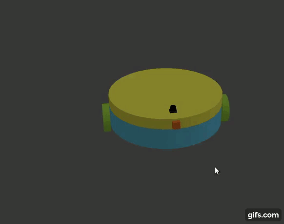
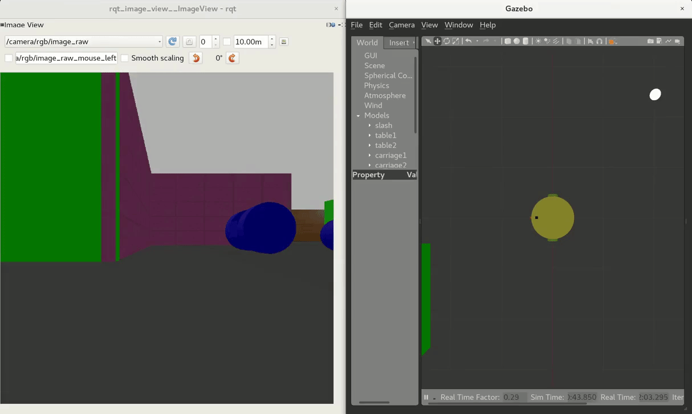

[](https://www.udacity.com/robotics)

# udacity-robond-p2
Go Chase It! - Project 2 of the Udacity Robotics Software Engineer Nanodegree

## Description

This project contains:
1. Two-wheeled robot that:
  - supports differential drive (and is stable)
  - is housed in the world created in [Build My World](https://github.com/PenguinLemma/udacity-robond-p1 "RoboND Project 1 - PenguinLemma")
  - is equiped with a camera and a lidar
2. White ball that will be chased by the robot
3. C++ source code of nodes that will command the robot to chase the ball, in the case the camera is seeing the ball.

As an extra feature, in the case the ball is not being seen by the camera, the robot is commanded to rotate scanning its surroundings until the camera captures the ball or a full turn has been made. Scanning will only happen after the robot is stopped for 2 seconds and it won't repeat until after the robot chased the ball.

### Robot

The robot consists on:
- A cylindrical base (chassis) with two caster balls to provide stability
- Two wheels joint by continuous joints to opposite points of the chassis situated in an axis that is orthogonal to the axis formed by the centers of the two caster balls.
- A basis for the sensors, which is a cylinder of the same radius than the chassis joint to it with a continuous joint (in the center of the two touching circular faces of sensor basis and chassis). The idea behind it is that if the scan of the surroundings is extracted as an action, we can rotate the sensors platform instead of rotating the robot, and then align the robot with the camera in the case the ball was found. This way, the node in charge of scanning would only need to interact with the joint in the sensors basis.
- Front camera
- Lidar (hokuyo)

<p align="center">
  
</p>

### Nodes

1. `chase_ball` is the main node that will decide whether to stop, scan or chase the ball based on the output of node `process_image`, and command the robot consequently.

2. `drive_bot` publishes the right `geometry_msgs/Twist` message to the `differential_drive_controller` whenever the service `/ball_chaser/command_robot` is requested.

3. `process_image` scans raw images published by the camera (it subscribes to topic `/camera/rgb/image_raw`) and publishes the normalized position of the ball in the image to the topic `/ball_chaser/ball_norm_position`. This message is of type `ball_chaser::NormalizedPosition`:
  ```
  # Message containing normalized position of an object in an image.
  # Both components (horizontal and vertical) are in [-1, 1]
  bool contains_object
  float64 horizontal
  float64 vertical
  ```
   The horizontal component of the normalized position of a pixel in an image is its position with respect to the vertical line that crosses the image by its half, scaled to be in [-1, 1]. The definition of the vertical component is analogous, using in this case the horizontal line that crosse the image by its half as reference.

Calls to service `/ball_chaser/command_robot` were moved from `process_image` to `chase_ball` in order to isolate the decision/command process from the environment analysis (processing of the image).

### Behaviour

1. Ball is seen by camera
   In this case, the robot will drive towards the ball, turning left of right based on the position of the ball in the image.

  <p align="center">
    
  </p>

2. Ball is not seen by the camera
   Robot remains static for 2 seconds. After that, it starts rotating to scan its surroundings.
      - If at some point the ball is perceived by the camera, the robot will start chasing the ball again (as in 1).
        <p align="center">
          
        </p>
      - If the robot makes a full rotation without finding the ball, it will remain static until exposed to the ball (i.e. it won't scan again the surroundings and nothing will happen unless the ball is put in sight of the standing robot).
        <p align="center">
          
        </p>

## Instructions

1. Clone the repository

```git
git clone https://github.com/PenguinLemma/udacity-robond-p1.git PenguinLemmaRoboND_P2
```

2. Initialise catkin workspace and set env variables

```shell
cd PenguinLemmaRoboND_P2
catkin_make
source set_env_var_$VERSION.$SHELL
```
where $SHELL can be "sh", "bash" or "zsh" and $VERSION can be "pre_melodic" or "melodic".

3. Launch the world
```shell
roslaunch my_robot world.launch
```
4. Launch ball_chaser nodes in a new terminal
```shell
cd $PATH_TO_PARENT_DIR/PenguinLemmaRoboND_P2
source set_env_var_$VERSION.$SHELL
roslaunch ball_chaser ball_chaser.launch
```
5. Run rqt_image_view in a new terminal to see what the camera sees
```shell
cd $PATH_TO_PARENT_DIR/PenguinLemmaRoboND_P2
source set_env_var_$VERSION.$SHELL
rosrun rqt_image_view rqt_image_view
```
You can also use the RViz window that is already launched together with the gazebo simulation.

6. Drop the ball
In gazebo, click on `insert` and then select `my_ball`. Drop it somewhere in the world (preferably in sight of the robot) and move it around to see how the robot reacts to the different situations. Don't worry, be cheeky! :)


## Future improvements

- [x] Include white sphere in the world at spawn
- [x] Change piece-wise defined angular velocity function to a simpler one using `tanh`
- [ ] Use relative vertical position of the lowest white pixel as means of distance to sphere and stop the robot when it's close enough to the target
- [ ] Add namespaces in nodes' source code
- [ ] Extract constants in nodes' source code
- [ ] Extract some of those constants as parameters and use ROS' parameter server
- [ ] Resize robot (chasis and sensors base radius, mainly) so that it fits through the doors ^^
- [x] In chase_ball.cpp, in the case the ball was not found in the image, scan surroundings (set angular_z velocity to positive). After a full turn, if it's still not found, stop the robot.
- [ ] As in previous point, but after the fulll scan, if ball is still not found move randomly and remember to not scan surroundings for a while, to avoid ballroom dancing.
- [ ] Use `opencv` to detect spheres of any give color and find their centroid
- [ ] Extract "scan_surroundings" and "go_somewhere_else" as actions

## License
Original version of the license of this repository can be found here:
https://gist.github.com/laramartin/7796d730bba8cf689f628d9b011e91d8
